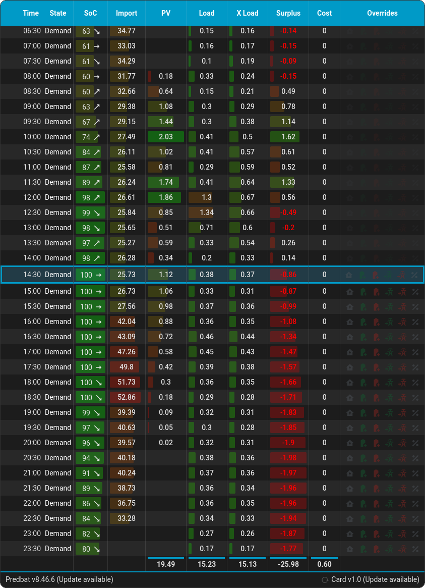

# Predbat-Table-Card

Predbat Table Card is a custom Home Assistant card that displays your [Predbat](https://github.com/springfall2008/batpred) energy management plan in a clean, compact table format. It provides an overview of your solar, battery, and grid interactions across 30-minute intervals, including import/export rates, PV forecasts, load consumption, battery state of charge, and cost tracking. The card supports dynamic column visibility, responsive layouts for mobile, tablets and desktop, and override controls for manual demand/charge/export management. It provides an intuitive way to monitor and control your Predbat energy system directly from your dashboard.

Works with Predbat installed as a HAOS app, or as a Docker container.



My system doesn't have all the features Predbat supports, which means I can't test it 100%, so feel free to feed back any problems you find. Thanks.

Inpired by the original, but now abandoned, predbat-table-card.

## HACS Installation (addition to HACS is currently under review - use manual install process for now)

1. Open HACS
2. Add `https://https://github.com/llbbdd/Predbat-Table-Card-Next` as a custom repository, using the `Dashboard` category
3. Search for `Predbat Table Card Next` in the HACS store
4. Download and refresh
5. Go to your chosen dashboard and select `edit`
6. Select `add card` button
7. Add the `Predbat Table Card Next` card

## Manual Installation

If you prefer to install the card manually or are not using HACS, you can follow these steps:

1.  **Download the latest release**:
    - Go to the [Releases](https://github.com/llbbdd/Predbat-Table-Card-Next/releases) page of this repository.
    - Download the `Predbat-Table-Card-Next.js` file from the latest release's assets (or download the source code zip and extract it).

2.  **Place the file in your Home Assistant configuration directory**:
    - Copy the `Predbat-Table-Card-Next.js` file into your Home Assistant `config/www/` directory. If the `www` folder doesn't exist, create it.
    - For example, the file path might be: `/config/www/Predbat-Table-Card-Next.js`.

3.  **Add the resource to your Lovelace configuration**:
    - In your Home Assistant dashboard, go to **Settings** → **Dashboards**.
    - Click the three-dot menu (⋮) and select **Resources**.
    - Click **Add Resource**.
    - Enter the URL: `/local/Predbat-Table-Card-Next.js?v=1.0.0` (replace `1.0.0` with the version you downloaded, and remember to update when upgrading).
    - Select **JavaScript Module** as the resource type and click **Create**.

4.  **Add the card to your dashboard**:
    - Go to your dashboard and enter edit mode.
    - Click the **"Add Card"** button and choose **"Manual Card"**.
    - Paste the following configuration, adjusting the options as needed:

```yaml
type: custom:predbat-card-next
entity: predbat.plan_html
columns:
  - state-column
  - soc-column
  - limit-column
  - import-column
  - export-column
  - pv-column
  - clip-column
  - load-column
  - xload-column
  - car-column
  - net-energy-column
  - cost-column
  - overrides-column
weather_entity: weather.forecast_home
day_limit: 2
battery_lower_limit: 20
```

## Card Configuration

These config items can either be set in the YAML or the Home Assistant UI config editor:

| Configuration Item | Required | Value |
|----------|----------|----------|
| `type`   | YES    | `predbat-card-next`    |
| `day_limit`    | YES    | See [Day Limit](#day-limit) |
| `columns`    | YES    | See [Column Options](#column-options) |
| `battery_lower_limit`    | NO    | See [Battery Lower Limit](#battery-lower-limit) |
| `weather_entity`    | NO    | See [Weather Forecast](#weather-forecast) |

### Example YAML config

```yaml
type: custom:predbat-card-next
day_limit: 2
entity: predbat.plan_html
columns:
  - import-column
  - export-column
  - state-column
  - limit-column
  - pv-column
  - load-column
  - soc-column
  - cost-column
  - overrides-column
  - car-column
  - clip-column
  - co2kg-column
  - iboost-column
  - net-energy-column
  - xload-column
weather_entity: weather.forecast_home_2
```

## Day Limit

Limits the number of days the plan returns. The plan will always show full days, so that daily totals are correct, but will only show a day if Predbat has import/export price data.

## Column Options

| Column Name | Column YAML | Description |
|----------------|----------------------------|----------|
| Import   | `import-column`    | Import unit price    |
| Export   | `export-column`    | Export unit price    |
| State   | `state-column`    | Operation status of the system - Discharging (demand), charging, etc    |
| Limit   | `limit-column`    | Target battery SoC that Predbat uses while charging or discharging    |
| PV   | `pv-column`    | Predicted PV generation    |
| Load   | `load-column`    | Predicted home load    |
| SoC   | `soc-column`    | Predicted battery SoC percentage    |
| Cost   | `cost-column`    | Predicted cost or gain    |
| Car   | `car-column`    | Predicted car charging (only shows when enabled in Predbat)   |
| iBoost   | `iboost-column`    | Predicted iBoost usage (only shows when enabled in Predbat)   |
| CO2 kg   | `co2kg-column`    | Predicted carbon intensity in kg (only shows when enabled in Predbat)   |
| XLoad   | `xload-column`    | Predicted load if also using Predheat (only shows when enabled in Predbat)  |
| Clipping   | `clip-column`    | Predicted PV clipping (only shows when enabled in Predbat)   |
| Surplus   | `net-energy-column`    | Predicted net energy (excess PV after home, car and iBoost loads are subtracted)   |
| Weather   | `weather-column`    | Predicted weather condition   |
| Temperature   | `temp-column`    | Predicted temperature   |
| Chance Of Rain   | `rain-column`    | Predicted chance of rain   |
| Overrides   | `overrides-column`    |  Show icons to manage manual state overrides - See [Overides](#override-actions)   |

Column order can be changed by re-ordering the YAML.

## Weather Forecast

Add a valid weather forecast entity using `weather_entity`, and add any combination of `weather-column`, `temp-column` or `rain-column` to the columns array. The column will be hidden until forecast data is received. For valid weather forecast entities see [Home Assistant docs](https://community.home-assistant.io/t/definitive-guide-to-weather-integrations/736419).

## Battery Lower Limit

By default, SoC bar colours are scaled from red (0%) to green (100%). Since the battery will shut off at a level set in the inverter/battery, we can narrow the scale to work within that range to increase the definition between battery levels. For example, if the battery lower limit is 20%, the colour scale will be red (20%) to green (100%), giving a larger visual difference between any two percentages.

## Override Actions

Overrides allow Predbat to be forced into a user-defined state, regardless of the plan, in any half hour slot. For example, a slot intended for charging can be forced to export instead.

The following Predbat overrides are supported:
- Force Demand
- Force/Prevent Charge
- Force/Prevent Export
- Force SoC Target

## Known Issues
- Sometimes the half-hour just passed disappears, and I've no idea why. If you check the Predbat web plan, and click between Plan and History, you'll see it's missing there too.
- Weather forecast data is only supplied for the future, so information disappears as the day passes.

## Requirements

Needs Predbat version > 8.29.7